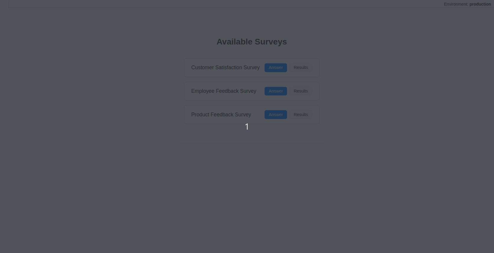

# Survey Application (Full Stack)


This repository contains a full-stack **Survey App** built with:

-  **Spring Boot** (Java 17) for the backend API  
-  **Vue 3 + TypeScript** for the frontend UI  
-  PostgreSQL as the database  
-  Docker for local development


## Demo



---

##  Project Structure

```
.
├── backend/        # Spring Boot API
├── frontend/       # Vue 3 + TS client
├── .github/        # CI workflows
├── docker-compose.yml
└── readme.md
```

---

##  Quick Start

###  Prerequisites

- Java 17
- Node.js (>= 18)
- Docker & Docker Compose

###  Dev development

```bash
 docker compose -f docker-compose.dev.yml --env-file .env up --build --force-recreate -d
 // then start front and back
 // docker compose --env-file .env up
 // the .env file 

##  Backend

```bash
./mvnw spring-boot:run
```

### Run tests

```bash
./mvnw test
```

### Lint & format

```bash
./mvnw spotless:check      # Check formatting
./mvnw spotless:apply      # Format code
```

More details: [`backend/README.md`](./backend/README.md)

---

## 🖥️ Frontend


### Run locally

```bash
npm install
npm run dev
```

### Run tests

```bash
npm run test
```

### Lint & format

```bash
npm run lint
npm run format
```

More details: [`frontend/README.md`](./frontend/README.md)

---

## ✅ CI Pipeline

GitHub Actions workflow runs on every push & pull request to:

- Run backend tests (`mvnw verify`)
- Check Java code format (`mvnw spotless:check`)
- Run frontend unit tests (`Vitest`)
- Lint frontend code (`npm run lint`)

---

## 📬 API Overview

- `GET /surveys/{id}` – Fetch survey questions
- `POST /surveys/{id}/responses` – Submit survey answers
- `GET /surveys/{id}/results` – View aggregated results

---

## 🧪 Demo Surveys

Demo survey data is automatically seeded on backend startup (only if DB is empty).

---

## 📄 License

BSD 3-Clause
